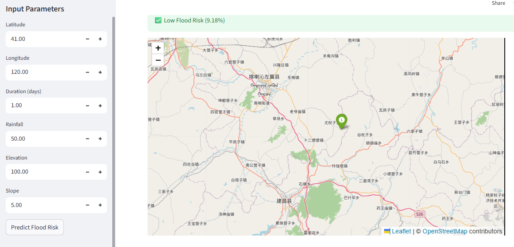

# 🌊 Geospatial Flood Risk Predictor

<p align="center">


</p>

---

## 🌍 Overview

**Geospatial Flood Risk Predictor** is an interactive machine learning web application that estimates flood risk based on environmental and geospatial factors. Built using **Python**, **XGBoost**, **Streamlit**, and **Folium**, the application allows users to input geographic and environmental parameters and instantly receive a flood risk prediction displayed alongside an interactive map.

The project demonstrates the practical integration of **machine learning**, **data preprocessing**, **geospatial visualization**, and **web deployment** into a user-friendly decision support system.

---

## 🚀 Live Demo

🌐 **Try the application here**

https://geospatial-flood-risk-predictor.streamlit.app/

---

# 📸 Application Preview

> **Main Prediction Interface**



---

# ✨ Features

- 🌍 Interactive geospatial visualization using Folium
- 🤖 Flood risk prediction powered by an XGBoost classifier
- 📍 Coordinate-based prediction system
- 📊 Environmental parameter analysis
- ⚡ Real-time prediction through Streamlit
- 💾 Pre-trained machine learning model
- 🧭 User-friendly and responsive interface

---

# 🏗️ System Workflow

```text
             User Input
                  │
                  ▼
      Environmental Parameters
                  │
                  ▼
        Data Preprocessing
                  │
                  ▼
         Feature Scaling
                  │
                  ▼
      XGBoost Prediction Model
                  │
                  ▼
     Flood Risk Classification
                  │
                  ▼
 Interactive Geospatial Visualization
                  │
                  ▼
          Prediction Result
```

---

# 🧠 Machine Learning Pipeline

The application follows a structured machine learning workflow:

1. Load the historical flood dataset.
2. Clean and preprocess the data.
3. Normalize numerical features using a scaler.
4. Train an **XGBoost Classifier**.
5. Save the trained model and scaler using Joblib.
6. Load the model during application startup.
7. Predict flood risk from user-provided environmental inputs.
8. Display prediction results alongside an interactive map.

---

# 🌎 Prediction Parameters

The prediction model evaluates the following environmental variables:

| Feature | Description |
|----------|-------------|
| Latitude | Geographic latitude |
| Longitude | Geographic longitude |
| Duration | Flood duration (days) |
| Rainfall | Rainfall measurement |
| Elevation | Elevation above sea level |
| Slope | Terrain slope |

---

# 📂 Project Structure

```text
Geospatial-flood-risk-prediction/
│
├── app/
│   └── app.py
│
├── data/
│   ├── raw/
│   │     flood_dataset_classification.csv
│   │
│   └── processed/
│         flood_data_processed.csv
│
├── models/
│   ├── model.pkl
│   └── scaler.pkl
│
├── notebook/
│   └── exploration.ipynb
│
├── src/
│   ├── preprocess.py
│   ├── train.py
│   └── predict.py
│
├── requirements.txt
├── README.md
└── .gitignore
```

---

# 📋 Module Description

### 📁 app/

Contains the Streamlit web application responsible for user interaction and visualization.

---

### 📁 src/

Contains the project's core machine learning logic.

- **preprocess.py** – Data preprocessing and feature engineering
- **train.py** – Model training and evaluation
- **predict.py** – Loads the trained model and performs inference

---

### 📁 models/

Stores serialized machine learning artifacts.

- Trained XGBoost model
- Feature scaler

---

### 📁 data/

Contains both the raw and processed datasets used throughout the project.

---

### 📁 notebook/

Contains exploratory data analysis (EDA), experiments, and model development notebooks.

---

# ⚙️ Technologies Used

| Technology | Purpose |
|------------|---------|
| Python | Core programming language |
| Streamlit | Web application framework |
| XGBoost | Machine learning model |
| Pandas | Data manipulation |
| NumPy | Numerical computing |
| Scikit-learn | Data preprocessing |
| Joblib | Model serialization |
| Folium | Interactive geospatial visualization |

---

# 📊 Machine Learning Model

The prediction engine is built using the **Extreme Gradient Boosting (XGBoost)** algorithm.

XGBoost was selected because it:

- Handles structured tabular data efficiently
- Provides excellent predictive performance
- Supports non-linear relationships
- Is widely used in real-world machine learning applications

The trained model estimates flood risk based on environmental characteristics and geographical information.

---

# 🗺️ Geospatial Visualization

The application integrates **Folium** to display an interactive map.

Users can:

- View selected locations
- Visualize prediction points
- Navigate using zoom and pan controls
- Explore geographical context

---

# 💻 Installation

Clone the repository

```bash
git clone https://github.com/Tiaaan12/Geospatial-flood-risk-prediction.git
```

Navigate into the project

```bash
cd Geospatial-flood-risk-prediction
```

Install dependencies

```bash
pip install -r requirements.txt
```

Run the application

```bash
streamlit run app/app.py
```

---

# 📈 Example Workflow

```text
Input Coordinates
        │
        ▼
Enter Environmental Variables
        │
        ▼
Click "Predict Flood Risk"
        │
        ▼
Model Inference
        │
        ▼
Flood Risk Classification
        │
        ▼
Interactive Map Display
```

---

# 🎯 Applications

This project can be adapted for:

- Flood Risk Assessment
- Environmental Monitoring
- Disaster Preparedness
- Geographic Decision Support Systems
- Educational Machine Learning Demonstrations
- Research Projects

---

# 🔮 Future Improvements

Potential future enhancements include:

- 🌦️ Weather API integration
- 🛰️ Satellite imagery support
- 📈 Time-series flood forecasting
- 🧠 Deep Learning models
- 🌍 Multi-region prediction
- 📊 Interactive analytics dashboard
- 📱 Mobile-responsive interface
- ☁️ Cloud database integration

---

# 🤝 Contributing

Contributions are welcome!

If you'd like to improve the project:

1. Fork the repository.
2. Create a feature branch.
3. Commit your changes.
4. Open a Pull Request.

---

# 👨‍💻 Author

## Christian Devera

**Bachelor of Science in Computer Science**

### Interests

- 🤖 Artificial Intelligence
- 📊 Data Analytics
- 🧠 Machine Learning
- 🌍 Geospatial Computing
- 🐍 Python Development
- ⚡ AI Automation

**GitHub**

https://github.com/Tiaaan12

---

# 📄 License

This project is released under the **MIT License**.

Feel free to use, modify, and distribute this project for educational and research purposes.

---

# ⭐ Support

If you found this project helpful or interesting, consider giving it a **⭐ Star** on GitHub.

Your support is greatly appreciated!
